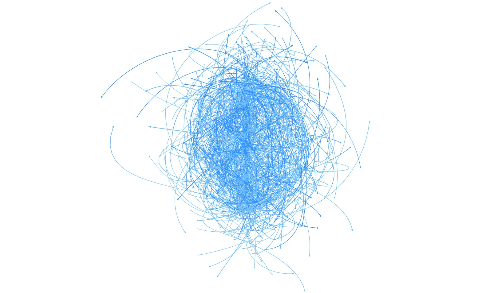
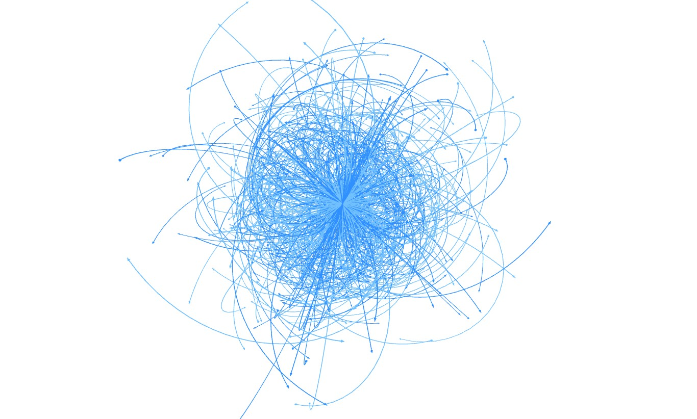
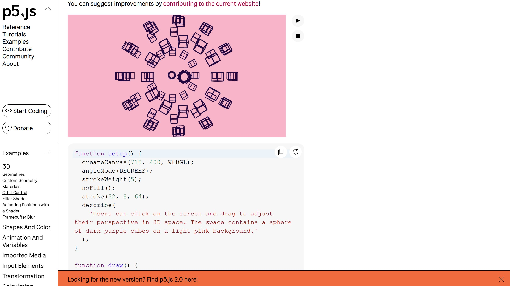

# Quiz 8 - guli0654_9103_tut5

## Part 1: Imaging Technique Inspiration

### Scroll-driven Cinematic Transformation

This example from acko.net presents a structured 3D particle system arranged in a spherical form. I am particularly interested in the way spatial organisation and camera movement work together to support interactive exploration. Rather than presenting a fixed visual, the system allows users to navigate and discover relationships between elements through input. This is beneficial for the assignment as it aligns with the requirement to develop a user input–driven mechanic, where interaction plays a central role in shaping the visual experience and creating a cohesive and engaging outcome.

## Part 2: Coding Technique Exploration

### Orbit Control

This example demonstrates the use of orbitControl() in p5.js to enable interactive camera movement in a 3D environment. By using mouse input, users can rotate, pan, and zoom within the scene, allowing them to explore visual structures from different perspectives. This technique supports the imaging approach by enabling navigation through a spatial system rather than presenting a fixed viewpoint. It is particularly useful for creating interactive experiences where user input controls how information is revealed and understood within a 3D space.

Example link: https://p5js.org/examples/3d-orbit-control/
